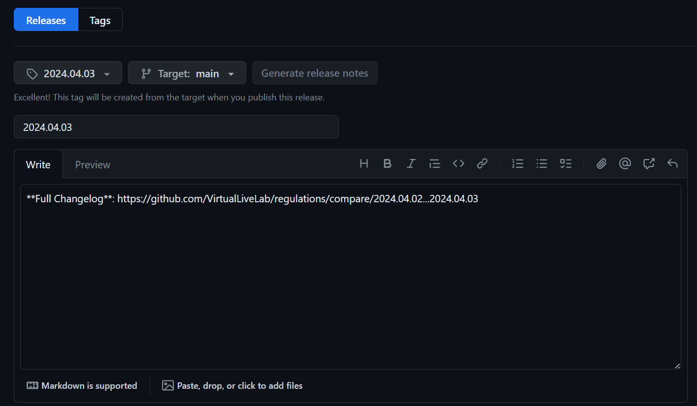
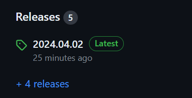

# バーチャルライブ研究会 会則管理用リポジトリ

## 表記上の注意

表記揺れを防ぐため以下の点に注意してください。

### 英数字について

- 必ず半角英数字を用いる

### かっこについて

- かっこは半角`()`を用いる
- 前には必ず半角スペースを挿入
- 後ろに文があれば後ろにも半角スペースを挿入

## 改定時の手順

### 1. ブランチの作成

改定・施行日に合わせたブランチを`yyyy-mm-dd`という名前で`main`から作成する。

例: 改定・施行日が2024年4月2日の場合→`2024-04-02`

### 2. 改定内容の入力

1.で作成したブランチに移動し、改定内容を入力する。
総会での決議ごとにコミットを分けることが望ましい。

### 3. 誤字脱字および表記規則チェック

誤字脱字と表記規則に関するチェックを行う。

> [!WARNING]
> 特に全角の`（）`や全角スペース、全角英数字の混入に注意すること。

気が向いたらGitHub Actionsでのチェックを導入する。

### 4. Pull Requestを作成

`main`ブランチへ向けてPull Requestを作成する。

マージ規則については、2024年4月時点では検討中である。

### 5. Releaseを作成

改定内容が`main`にマージされたらTagを切ってReleaseを作成する。

まずReleasesページへ移動し、上部の`Draft a New Release`をクリック。

次に`Choose a tag`をクリックして、新しいタグ名を入力することで改定・施行日に合わせたタグを作成する。

ただし、タグ命名規則には`yyyy.mm.dd`を採用する。

例: 改定・施行日が2024年4月2日の場合→`2024.04.02`

> [!CAUTION]
> ブランチ命名規則と異なることに注意。

---

その後、

- `Target: main`
- `Previous tag: auto`

であることを確認したら`Generate release notes`をクリックしてリリースノートを生成する。

この時点で下の写真のように

- Release Nameが自動的に`yyyy.mm.dd`に設定される
- Release NoteにChange Logが自動入力される

はずである。なお、Pull Requestをマージしたあとであればその記述も入力される。

> [!CAUTION]
> もしリリースノートを生成した際に上のいずれかを満たしていなければ何らかの間違いがある。
> 必ず引き返すこと。

---

リリース名とリリースノートが正しいことを確認したら、下部の`Set as the latest release`にチェックが入っていることを確認して`Publish release`をクリックする。

あとはリポジトリトップに戻り、Releasesの部分に正しい改定日と`Latest`が表示されていれば改定完了。

